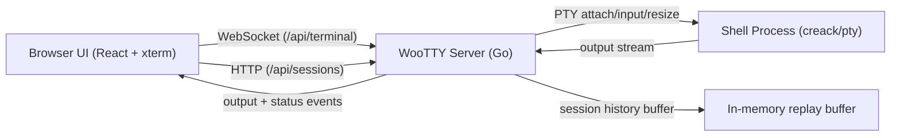

<p align="center">
  
</p>

<h1 align="center">WooTTY</h1>

<p align="center">
  <a href="https://github.com/icoretech/wootty/actions/workflows/ci.yml">
    
  </a>
  <a href="https://github.com/icoretech/wootty/releases">
    
  </a>
  <a href="./LICENSE">
    
  </a>
</p>

WooTTY is a clean-slate browser terminal designed for one non-negotiable outcome: a terminal experience that stays reliable under real pressure (resize storms, reconnects, long output, and unstable networks).


## Why WooTTY

- Terminal-first UI: maximum viewport, compact status bar, floating controls.
- Reconnect-safe sessions: resume by `sessionId`, replay buffered output.
- Tab-safe defaults: each browser tab starts its own live session unless the operator explicitly resumes one.
- Explicit multi-session actions: `Resume` for controllable sessions, `Watch` for sessions already controlled elsewhere (read-only).
- Resize fidelity: client and PTY stay in sync during rapid window changes.
- Operational defaults: high scrollback, keyboard-first controls, low-friction deployment.
- Deployment flexibility: minimal image by default, plus `-openssh` image variant for SSH workflows.
- Modern stack: Go 1.26+, Node 24+, React 19 + compiler, xterm.js.

## Table of Contents

- [Quick Start](#quick-start)
- [Run with Docker](#run-with-docker)
- [Kubernetes Deployments](#kubernetes-deployments)
- [Run from Source](#run-from-source)
- [Operator Controls](#operator-controls)
- [Configuration](#configuration)
- [Architecture](#architecture)
- [Testing and Quality](#testing-and-quality)
- [Contributing](#contributing)
- [Security](#security)

## Quick Start

### Docker Quick Start

Stable image from GitHub Container Registry:

```bash
docker run --rm -it \
  -p 8080:8080 \
  -e WOOTTY_AUTH_TOKEN=change-me-local \
  ghcr.io/icoretech/wootty:latest
```

Then open `http://127.0.0.1:8080/#token=change-me-local`.

For image flavors, SSH usage, direct command args, compose profiles, and custom images, see [Run with Docker](#run-with-docker).

### Run from Source

```bash
pnpm install
pnpm dev
```

Run dev with SSH alias target:

```bash
WOOTTY_COMMAND=/usr/bin/ssh WOOTTY_COMMAND_ARGS="my-ssh-host-alias" pnpm dev
```

Run WooTTY against `codex exec` (non-interactive Codex task in the terminal session):

```bash
cd apps/server
go run ./cmd/woottyd run --port 8080 \
  codex exec --skip-git-repo-check --ephemeral "Reply with exactly: hello-from-codex"
```

Same flow using environment variables:

```bash
WOOTTY_COMMAND=codex \
WOOTTY_COMMAND_ARGS='exec --skip-git-repo-check --ephemeral "Reply with exactly: hello-from-codex"' \
pnpm dev
```

- Web: `http://localhost:5173`
- Server: `http://127.0.0.1:8080` (auto-falls back to next free port if `8080` is busy)
- Set `WOOTTY_PORT` explicitly to force a fixed dev port.

Production-like local run:

```bash
pnpm build
cd apps/server
go run ./cmd/woottyd run --port 8080 bash
```

## Run with Docker

Build locally:

```bash
docker build -t wootty:dev .
docker run --rm -it \
  -p 8080:8080 \
  -e WOOTTY_AUTH_TOKEN=change-me-local \
  wootty:dev
```

Run profile-based examples from the root `docker-compose.yml`:

```bash
# default shell/runtime
docker compose up --build wootty

# login shell
docker compose --profile bash up --build wootty-bash

# ssh command mode (set your destination in docker-compose.yml)
docker compose --profile ssh up --build wootty-ssh

# long-running detached session retention profile (72h TTL)
docker compose --profile retention up --build wootty-retention

# deterministic fake PTY mode for tests/e2e
docker compose --profile test up --build wootty-fake-pty
```

The `wootty-ssh` profile builds the `final-openssh` target so `/usr/bin/ssh` is available in that container.

Build your own image with custom binaries:

```dockerfile
# Dockerfile.custom
FROM ghcr.io/icoretech/wootty:latest

# Install additional runtime tools your command needs.
RUN apt-get update \
  && apt-get install -y --no-install-recommends \
    ffmpeg \
    rsync \
    openssh-client \
  && rm -rf /var/lib/apt/lists/*

# Optional: add your own binary/script
# COPY ./bin/my-tool /usr/local/bin/my-tool
# RUN chmod +x /usr/local/bin/my-tool
```

```bash
docker build -f Dockerfile.custom -t wootty:custom .
docker run --rm -it -p 8080:8080 \
  -e WOOTTY_COMMAND=/usr/bin/ssh \
  -e WOOTTY_COMMAND_ARGS="user@example.com" \
  wootty:custom
```

Equivalent direct-args form:

```bash
docker run --rm -it -p 8080:8080 \
  wootty:custom \
  run /usr/bin/ssh user@example.com
```

Use this pattern whenever `WOOTTY_COMMAND` depends on binaries not present in the default image.

The container serves:

- backend API/websocket on `/api/*`
- web UI bundled from `apps/web/src`

## Kubernetes Deployments

### Embed `wootty` Into Your App Image

```dockerfile
# Your existing runtime image
FROM your-runtime-image:tag

# Keep this pinned and automated (example Renovate comment)
# renovate: datasource=docker depName=ghcr.io/icoretech/wootty versioning=semver
COPY --from=ghcr.io/icoretech/wootty:<version> /usr/local/bin/wootty /usr/local/bin/wootty
```

Then start WooTTY as your container command (or entrypoint), pointing to the shell/binary you want:

```bash
wootty run bash
```

### Minimal Kubernetes Manifests (Official Image)

```yaml
apiVersion: apps/v1
kind: Deployment
metadata:
  name: myapp-webcli
  namespace: myapp
spec:
  replicas: 1
  selector:
    matchLabels:
      app: myapp-webcli
  template:
    metadata:
      labels:
        app: myapp-webcli
    spec:
      containers:
        - name: webcli
          # Or use ghcr.io/icoretech/wootty:latest-openssh or your own custom image.
          image: ghcr.io/icoretech/wootty:latest
          imagePullPolicy: IfNotPresent
          command: ["/bin/sh", "-lc"]
          args:
            - |
              exec wootty run bash
          ports:
            - name: http
              containerPort: 8080
          env:
            - name: WOOTTY_AUTH_TOKEN
              valueFrom:
                secretKeyRef:
                  name: wootty-auth
                  key: token
          readinessProbe:
            httpGet:
              path: /api/health
              port: http
          livenessProbe:
            httpGet:
              path: /api/health
              port: http
---
apiVersion: v1
kind: Service
metadata:
  name: myapp-webcli
  namespace: myapp
spec:
  selector:
    app: myapp-webcli
  ports:
    - name: http
      port: 8080
      targetPort: http
```

### Deployment Ideas

- Keep web CLI in a dedicated deployment (`myapp-webcli`) so scaling/restarts are independent from your main app.
- Protect ingress with SSO, IP allowlists, or both; avoid exposing an unauthenticated terminal endpoint.
- Set `WOOTTY_AUTH_TOKEN` from a Secret and rotate it like any other credential.
- Use direct command args when you want a non-shell target, for example `wootty run /usr/bin/ssh user@example.com` or `wootty run /usr/local/bin/your-admin-tool --flag value`.

## Operator Controls

Keyboard shortcuts:

- `Ctrl/Cmd+Shift+R`: reconnect
- `Ctrl/Cmd+Shift+K`: clear viewport
- `Ctrl/Cmd+Shift+=`: increase font size
- `Ctrl/Cmd+Shift+-`: decrease font size
- `Ctrl/Cmd+Shift+0`: reset font size
- `Ctrl/Cmd+Shift+F`: fullscreen
- `Ctrl/Cmd+Shift+B`: toggle controls

Status bar metrics:

- connection status and latency
- session id
- attach mode (`Control` or `Read-only`)
- reconnect count
- buffered/dropped input size (humanized units)
- output size (humanized units)

Session controls:

- click the `Session` badge in the status bar to open the session menu.
- `New session`: start a fresh session in the current tab.
- `Resume last`: reattach the last session id seen in this browser.
- session menu separates `Live sessions` (running on server) from `Recent session ids` (browser memory only).
- sessions already controlled in another tab/operator are shown as `Watch` (read-only attach).
- resumable sessions are shown as `Resume` (full control attach).
- recent ids that are not running are shown as unavailable.
- tabs do not implicitly steal active sessions from each other.
- terminal font starts at minimum (`11px`) by default and can be changed from controls/shortcuts.

## Configuration

| Variable | Default | Description |
| --- | --- | --- |
| `WOOTTY_HOST` | `127.0.0.1` | Bind address for direct host runs |
| `WOOTTY_PORT` | `8080` | HTTP/WebSocket port |
| `WOOTTY_DETACHED_TTL_MS` | `86400000` | Hard TTL for running detached sessions (24h). `0` disables this TTL |
| `WOOTTY_HISTORY_BYTES` | `5242880` | Buffered output bytes for replay |
| `WOOTTY_COMMAND` | `$SHELL` or `bash` | Executed command in the `woottyd` runtime environment (host or container) |
| `WOOTTY_COMMAND_ARGS` | _empty_ | Shell-like command args string (supports quotes and escapes) |
| `WOOTTY_CWD` | current directory | Process working directory |
| `WOOTTY_STATIC_DIR` | auto-detected | Directory with built web assets |
| `WOOTTY_AUTH_TOKEN` | _empty_ | Required when binding to a non-loopback host; used to bootstrap the auth cookie consumed by `/api/sessions` and `/api/terminal` |
| `WOOTTY_ALLOWED_ORIGINS` | _empty_ | Optional comma-separated websocket origin allowlist |
| `WOOTTY_ALLOW_INSECURE_NO_AUTH` | _empty_ | Set to `1` only to allow explicit unauthenticated non-loopback binds on trusted local networks |
| `WOOTTY_FAKE_PTY` | `0` | Set to `1` for deterministic fake PTY mode |

`WOOTTY_COMMAND_ARGS` examples:

```bash
# 1) Run a shell command with spaces
WOOTTY_COMMAND=/bin/bash
WOOTTY_COMMAND_ARGS='-lc "echo hello world && whoami"'

# 2) SSH with multiple options
WOOTTY_COMMAND=/usr/bin/ssh
WOOTTY_COMMAND_ARGS='-o StrictHostKeyChecking=no -p 2222 user@example.com'

# 3) Include escaped quotes inside an argument
WOOTTY_COMMAND=/bin/bash
WOOTTY_COMMAND_ARGS='-lc "echo \"quoted text\" && date"'

# 4) Pass an explicit empty argument ("")
WOOTTY_COMMAND=/bin/bash
WOOTTY_COMMAND_ARGS='-lc "printf \"[%s]\\n\" \"\" \"non-empty\""'
```

If `WOOTTY_COMMAND_ARGS` has invalid quoting (for example an unterminated quote), WooTTY fails fast on startup with a config error.

CLI equivalent is available for detached retention timing: `--detached-ttl-ms`.

For non-local deployments, WooTTY now fails fast unless `WOOTTY_AUTH_TOKEN` is set. Browser sessions should be bootstrapped with a URL hash such as `/#token=...`, which is exchanged once for the `wootty_auth` cookie and then removed from the address bar. Query-string tokens are not supported anymore. Use `WOOTTY_ALLOWED_ORIGINS` as an extra browser-side guard. `WOOTTY_ALLOW_INSECURE_NO_AUTH=1` is only for trusted local networks and should not be used for published services.

### Session Retention Model

- Session metadata and PTY state are in-memory only.
- If a terminal process exits, the session is removed immediately.
- If a terminal process is still running and no controller/watcher is attached:
  - `WOOTTY_DETACHED_TTL_MS > 0`: session is cleaned up after that TTL.
  - `WOOTTY_DETACHED_TTL_MS = 0`: timer cleanup is disabled; session remains available until process exit or server restart.
- Server restart clears all sessions because there is no persistent session store.

Recommended for long-running jobs with occasional reconnects:

```bash
WOOTTY_DETACHED_TTL_MS=259200000  # 72h
```

Compose example:

```yaml
services:
  wootty:
    image: ghcr.io/icoretech/wootty:latest
    ports:
      - "8080:8080"
    environment:
      WOOTTY_DETACHED_TTL_MS: "259200000"
```

## Architecture



Frontend module ownership:

<!-- governance:module-ownership:start -->
- `apps/web/src/App.tsx`: composition entrypoint that mounts the terminal feature app.
- `apps/web/src/features/terminal/app/TerminalApp.tsx`: terminal app entrypoint and top-level composition shell.
- `apps/web/src/features/terminal/app/composition/*`: app-level composition boundaries (platform, domain, and controller wiring) that join environment adapters with feature hooks.
- `apps/web/src/features/terminal/app/engine/*`: transport lifecycle, runtime boot/IO bridge, and connection state projection.
- `apps/web/src/features/terminal/app/bindings/*`: browser/document/window/session bindings (shortcuts, refresh cadence wiring, resize/fullscreen wiring, title updates).
- `apps/web/src/features/terminal/environment/*`: environment contracts shared by app bootstrap and controller layers.
- `apps/web/src/features/terminal/commands/*`: terminal command contract + registry ownership (UI actions and shortcut mapping).
- `apps/web/src/features/terminal/contracts/*`: shared terminal contracts (session + transport types and ready-state constants).
- `apps/web/src/features/terminal/platform/*`: platform-facing utilities shared by app/engine bindings (for example scheduler abstractions).
- `apps/web/src/features/terminal/components/*`: presentational controls, status bar, and session menu UI.
- `apps/web/src/features/terminal/view/*`: UI-facing formatting and presenter mapping for menu/session copy.
- `apps/web/src/features/terminal/commands/floating-controls/*`: floating-controls registry, metadata, and descriptor assembly.
- `apps/web/src/features/terminal/notifications/*`: user-facing terminal notice mapping.
- `apps/web/src/features/terminal/session/domain/*`: session candidate derivation and domain-level selection helpers.
- `apps/web/src/features/terminal/session/protocol/*`: session payload parsing and refresh failure protocol ownership.
- `apps/web/src/features/terminal/session/persistence/*`: storage adapters and storage key ownership.
- `apps/web/src/features/terminal/lib/*`: terminal-only utility helpers (formatting, outbox buffering).
- `apps/web/src/features/terminal/protocol/*`: protocol parsing owned by the terminal feature.
- `apps/web/src/features/terminal/adapters/*`: transport adapters owned by the terminal feature.
- `apps/web/src/features/terminal/runtime/*`: xterm runtime loading owned by the terminal feature.
<!-- governance:module-ownership:end -->

### Client Protocol Contract

`apps/web/src/features/terminal/protocol/terminal-protocol.ts` is the client-side source of truth for websocket payload parsing.

- Supported inbound message `type` values: `ready`, `output`, `exit`, `error`, `pong`.
- Required fields:
  - `ready`: `sessionId` (string), `readOnly` (boolean), `version` (must match `TERMINAL_WIRE_CONTRACT_VERSION`)
  - `output`: `data` (string)
  - `exit`: `code` (number), `signal` (number)
  - `error`: `message` (string), optional `code` (known server code string). Unknown non-empty codes are surfaced as `rawCode`.
  - `pong`: no additional fields
- Compatibility policy:
  - Additive fields are allowed and ignored by older clients.
  - Unknown message `type` values are treated as unsupported and surfaced as a user notice.
  - Invalid payload shapes are dropped by the parser and do not mutate terminal state.

### Transport Lifecycle Contract

Transport responsibilities are split by contract:

- `apps/web/src/features/terminal/contracts/transport/transport.ts` defines the transport surface and ready-state constants used by app runtime and test doubles.
- `apps/web/src/features/terminal/app/engine/transport/state/transport-policy.ts` defines heartbeat intervals, close codes, and reconnect delay policy.
- `apps/web/src/features/terminal/adapters/transport-event-normalizer.ts` adapts browser runtime events into typed contract payloads.

- Canonical ready states:
  - `TRANSPORT_READY_STATE.CONNECTING` (`0`)
  - `TRANSPORT_READY_STATE.OPEN` (`1`)
  - `TRANSPORT_READY_STATE.CLOSING` (`2`)
  - `TRANSPORT_READY_STATE.CLOSED` (`3`)
- Heartbeat policy:
  - Client sends `ping` every `12s` while connected.
  - Missing `pong` for `12s` triggers close code `4103` (`pong timeout`) and reconnect flow.
- Close/reconnect policy:
  - Manual reconnect closes with `4101`.
  - Starting a fresh session closes old transport with `4102`.
  - Backoff uses `reconnectDelayMs(attempt)` (`300ms * 1.8^attempt`, capped at `5000ms`).

## Testing and Quality

Standard quality gates:

```bash
pnpm lint
pnpm test
pnpm build
pnpm test:e2e
```

One-shot local CI parity:

```bash
pnpm run ci
```

Cross-browser browser matrix (Chromium + Firefox + WebKit):

```bash
pnpm test:e2e:cross
```

Notes:

- `pnpm lint` applies Biome fixes, runs `go fix` on the server module, and then runs typecheck.
- `pnpm lint:ci` is the non-mutating CI variant: `biome ci`, `gofmt` verification, docs/governance checks, and typecheck.
- Test environment ownership:
  - Browser test polyfills and setup wiring live under `apps/web/test/support/`.
  - E2E URL/port defaults live under `apps/web/config/e2e/e2e-env.ts`.
  - App integration harness composition lives in `apps/web/test/integration/app/harness/`.

## Contributing

Read [CONTRIBUTING.md](./CONTRIBUTING.md) before opening a PR.

## Security

Report vulnerabilities through [SECURITY.md](./SECURITY.md).
