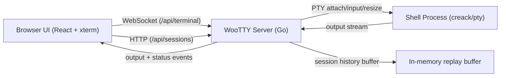

# WooTTY

[](https://github.com/icoretech/wootty/actions/workflows/ci.yml)
[](https://github.com/icoretech/wootty/actions/workflows/release-please.yml)
[](https://github.com/icoretech/wootty/releases)
[](https://nodejs.org/)
[](https://go.dev/)
[](./LICENSE)

Flawless browser terminal for real operators.

WooTTY is a clean-slate browser terminal designed for one non-negotiable outcome: a terminal experience that stays reliable under real pressure (resize storms, reconnects, long output, and unstable networks).


## Why WooTTY

- Terminal-first UI: maximum viewport, compact status bar, floating controls.
- Reconnect-safe sessions: resume by `sessionId`, replay buffered output.
- Tab-safe defaults: each browser tab starts its own live session unless the operator explicitly resumes one.
- Explicit multi-session actions: `Resume` for controllable sessions, `Watch` for sessions already controlled elsewhere (read-only).
- Resize fidelity: client and PTY stay in sync during rapid window changes.
- Operational defaults: high scrollback, keyboard-first controls, low-friction deployment.
- Modern stack: Go 1.26+, Node 24+, React 19 + compiler, xterm.js.

## Table of Contents

- [Quick Start](#quick-start)
- [Run with Docker](#run-with-docker)
- [Run from Source](#run-from-source)
- [Operator Controls](#operator-controls)
- [Configuration](#configuration)
- [Architecture](#architecture)
- [Testing and Quality](#testing-and-quality)
- [Contributing](#contributing)
- [Security](#security)

## Quick Start

### Run with Docker

Stable image from GitHub Container Registry:

```bash
docker run --rm -it -p 8080:8080 ghcr.io/icoretech/wootty:latest
```

Then open `http://127.0.0.1:8080`.

Pin by version:

```bash
docker run --rm -it -p 8080:8080 ghcr.io/icoretech/wootty:v0.2.0
```

Run a custom command:

```bash
docker run --rm -it -p 8080:8080 \
  -e WOOTTY_COMMAND=/bin/bash \
  -e WOOTTY_COMMAND_ARGS="-l" \
  ghcr.io/icoretech/wootty:latest
```

### Run from Source

```bash
pnpm install
pnpm dev
```

- Web: `http://localhost:5173`
- Server: `http://127.0.0.1:8080`

Production-like local run:

```bash
pnpm build
cd apps/server
go run ./cmd/woottyd run --port 8080 bash
```

## Run with Docker

Build locally:

```bash
docker build -t wootty:dev .
docker run --rm -it -p 8080:8080 wootty:dev
```

The container serves:

- backend API/websocket on `/api/*`
- web UI from `apps/web/dist`

## Operator Controls

Keyboard shortcuts:

- `Ctrl/Cmd+Shift+R`: reconnect
- `Ctrl/Cmd+Shift+K`: clear viewport
- `Ctrl/Cmd+Shift+=`: increase font size
- `Ctrl/Cmd+Shift+-`: decrease font size
- `Ctrl/Cmd+Shift+0`: reset font size
- `Ctrl/Cmd+Shift+F`: fullscreen
- `Ctrl/Cmd+Shift+B`: toggle controls

Status bar metrics:

- connection status and latency
- session id
- reconnect count
- buffered/dropped input size (humanized units)
- output size (humanized units)

Session controls:

- click the `Session` badge in the status bar to open the session menu.
- `New session`: start a fresh session in the current tab.
- `Resume last`: reattach the last session id seen in this browser.
- session list merges live server sessions (`/api/sessions`) and local history entries.
- sessions already controlled in another tab/operator are shown as `Watch` (read-only attach).
- resumable sessions are shown as `Resume` (full control attach).
- tabs do not implicitly steal active sessions from each other.
- terminal font starts at minimum (`11px`) by default and can be changed from controls/shortcuts.

## Configuration

| Variable | Default | Description |
| --- | --- | --- |
| `WOOTTY_HOST` | `0.0.0.0` | Bind address |
| `WOOTTY_PORT` | `8080` | HTTP/WebSocket port |
| `WOOTTY_RECONNECT_GRACE_MS` | `30000` | Session retention window while reconnecting |
| `WOOTTY_HISTORY_BYTES` | `5242880` | Buffered output bytes for replay |
| `WOOTTY_COMMAND` | `$SHELL` or `bash` | Executed command |
| `WOOTTY_COMMAND_ARGS` | _empty_ | Space-separated command args |
| `WOOTTY_CWD` | current directory | Process working directory |
| `WOOTTY_STATIC_DIR` | auto-detected | Directory with built web assets |
| `WOOTTY_FAKE_PTY` | `0` | Set to `1` for deterministic fake PTY mode |

## Architecture



## Testing and Quality

Standard quality gates:

```bash
pnpm lint
pnpm test
pnpm build
pnpm test:e2e
```

Cross-browser browser matrix (Chromium + Firefox + WebKit):

```bash
pnpm test:e2e:cross
```

Notes:

- `pnpm lint` applies Biome fixes and then runs typecheck.
- CI enforces zero formatting drift (`git diff --exit-code`).

## Contributing

Read [CONTRIBUTING.md](./CONTRIBUTING.md) before opening a PR.

## Security

Report vulnerabilities through [SECURITY.md](./SECURITY.md).
