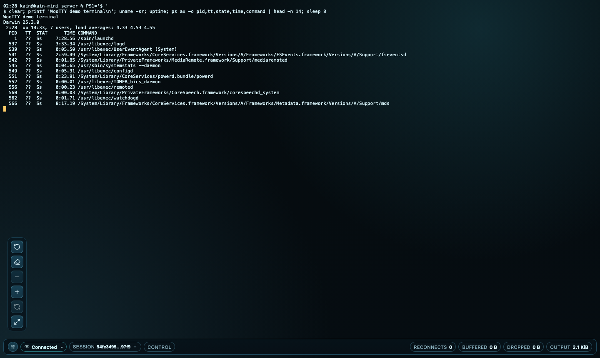
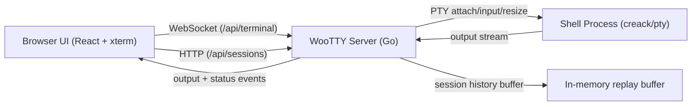

# WooTTY

[](https://github.com/icoretech/wootty/actions/workflows/ci.yml)
[](https://github.com/icoretech/wootty/actions/workflows/release-please.yml)
[](https://github.com/icoretech/wootty/releases)
[](https://nodejs.org/)
[](https://go.dev/)
[](./LICENSE)

Flawless browser terminal for real operators.

WooTTY is a clean-slate browser terminal designed for one non-negotiable outcome: a terminal experience that stays reliable under real pressure (resize storms, reconnects, long output, and unstable networks).



## Why WooTTY

- Terminal-first UI: maximum viewport, compact status bar, floating controls.
- Reconnect-safe sessions: resume by `sessionId`, replay buffered output.
- Tab-safe defaults: each browser tab starts its own live session unless the operator explicitly resumes one.
- Explicit multi-session actions: `Resume` for controllable sessions, `Watch` for sessions already controlled elsewhere (read-only).
- Resize fidelity: client and PTY stay in sync during rapid window changes.
- Operational defaults: high scrollback, keyboard-first controls, low-friction deployment.
- Modern stack: Go 1.26+, Node 24+, React 19 + compiler, xterm.js.

## Table of Contents

- [Quick Start](#quick-start)
- [Run with Docker](#run-with-docker)
- [Run from Source](#run-from-source)
- [Operator Controls](#operator-controls)
- [Configuration](#configuration)
- [Architecture](#architecture)
- [Testing and Quality](#testing-and-quality)
- [Contributing](#contributing)
- [Security](#security)

## Quick Start

### Run with Docker

Stable image from GitHub Container Registry:

```bash
docker run --rm -it -p 8080:8080 ghcr.io/icoretech/wootty:latest
```

Then open `http://127.0.0.1:8080`.

Pin by version:

```bash
docker run --rm -it -p 8080:8080 ghcr.io/icoretech/wootty:v0.2.0
```

Run a custom command:

```bash
docker run --rm -it -p 8080:8080 \
  -e WOOTTY_COMMAND=/bin/bash \
  -e WOOTTY_COMMAND_ARGS="-l" \
  ghcr.io/icoretech/wootty:latest
```

Runtime scope note:

- `WOOTTY_COMMAND` is executed by `woottyd` in its own runtime environment.
- If `woottyd` runs on your host, it can run host binaries.
- If `woottyd` runs in Docker, it can only run binaries available inside the image/container filesystem.
- For uncommon commands, build/use a custom image that includes the required binary.

### Run from Source

```bash
pnpm install
pnpm dev
```

- Web: `http://localhost:5173`
- Server: `http://127.0.0.1:8080`

Production-like local run:

```bash
pnpm build
cd apps/server
go run ./cmd/woottyd run --port 8080 bash
```

## Run with Docker

Build locally:

```bash
docker build -t wootty:dev .
docker run --rm -it -p 8080:8080 wootty:dev
```

The container serves:

- backend API/websocket on `/api/*`
- web UI bundled from `apps/web/src`

## Operator Controls

Keyboard shortcuts:

- `Ctrl/Cmd+Shift+R`: reconnect
- `Ctrl/Cmd+Shift+K`: clear viewport
- `Ctrl/Cmd+Shift+=`: increase font size
- `Ctrl/Cmd+Shift+-`: decrease font size
- `Ctrl/Cmd+Shift+0`: reset font size
- `Ctrl/Cmd+Shift+F`: fullscreen
- `Ctrl/Cmd+Shift+B`: toggle controls

Status bar metrics:

- connection status and latency
- session id
- reconnect count
- buffered/dropped input size (humanized units)
- output size (humanized units)

Session controls:

- click the `Session` badge in the status bar to open the session menu.
- `New session`: start a fresh session in the current tab.
- `Resume last`: reattach the last session id seen in this browser.
- session menu separates `Live sessions` (running on server) from `Recent session ids` (browser memory only).
- sessions already controlled in another tab/operator are shown as `Watch` (read-only attach).
- resumable sessions are shown as `Resume` (full control attach).
- recent ids that are not running are shown as unavailable.
- tabs do not implicitly steal active sessions from each other.
- terminal font starts at minimum (`11px`) by default and can be changed from controls/shortcuts.

## Configuration

| Variable | Default | Description |
| --- | --- | --- |
| `WOOTTY_HOST` | `0.0.0.0` | Bind address |
| `WOOTTY_PORT` | `8080` | HTTP/WebSocket port |
| `WOOTTY_RECONNECT_GRACE_MS` | `0` | Legacy detached-session cleanup timeout in ms (used only when `WOOTTY_DETACHED_TTL_MS=0`) |
| `WOOTTY_DETACHED_TTL_MS` | `86400000` | Hard TTL for running detached sessions (24h). `0` disables this TTL |
| `WOOTTY_HISTORY_BYTES` | `5242880` | Buffered output bytes for replay |
| `WOOTTY_COMMAND` | `$SHELL` or `bash` | Executed command in the `woottyd` runtime environment (host or container) |
| `WOOTTY_COMMAND_ARGS` | _empty_ | Space-separated command args |
| `WOOTTY_CWD` | current directory | Process working directory |
| `WOOTTY_STATIC_DIR` | auto-detected | Directory with built web assets |
| `WOOTTY_AUTH_TOKEN` | _empty_ | Optional bearer token required by `/api/sessions` and `/api/terminal` when set |
| `WOOTTY_ALLOWED_ORIGINS` | _empty_ | Optional comma-separated websocket origin allowlist |
| `WOOTTY_FAKE_PTY` | `0` | Set to `1` for deterministic fake PTY mode |

CLI equivalents are available for key timing controls: `--reconnect-grace-ms` and `--detached-ttl-ms`.

For non-local deployments, set `WOOTTY_AUTH_TOKEN` (and optionally `WOOTTY_ALLOWED_ORIGINS`) to protect session and websocket endpoints.

### Session Retention Model

- Session metadata and PTY state are in-memory only.
- If a terminal process exits, the session is removed immediately.
- If a terminal process is still running but no client is attached, the session is retained for `WOOTTY_DETACHED_TTL_MS`.
- If `WOOTTY_DETACHED_TTL_MS=0`, cleanup falls back to `WOOTTY_RECONNECT_GRACE_MS` behavior.
- Server restart clears all sessions because there is no persistent session store.

Recommended for long-running jobs with occasional reconnects:

```bash
WOOTTY_RECONNECT_GRACE_MS=0
WOOTTY_DETACHED_TTL_MS=259200000  # 72h
```

Example in Compose:

```yaml
environment:
  WOOTTY_RECONNECT_GRACE_MS: "0"
  WOOTTY_DETACHED_TTL_MS: "259200000"
```

## Architecture



Frontend module ownership:

<!-- governance:module-ownership:start -->
- `apps/web/src/App.tsx`: composition entrypoint that mounts the terminal feature app.
- `apps/web/src/features/terminal/app/TerminalApp.tsx`: terminal app entrypoint and top-level composition shell.
- `apps/web/src/features/terminal/app/composition/*`: app-level composition boundaries (platform, domain, and controller wiring) that join environment adapters with feature hooks.
- `apps/web/src/features/terminal/app/engine/*`: transport lifecycle, runtime boot/IO bridge, and connection state projection.
- `apps/web/src/features/terminal/app/bindings/*`: browser/document/window/session bindings (shortcuts, refresh cadence wiring, resize/fullscreen wiring, title updates).
- `apps/web/src/features/terminal/environment/*`: environment contracts shared by app bootstrap and controller layers.
- `apps/web/src/features/terminal/commands/*`: terminal command contract + registry ownership (UI actions and shortcut mapping).
- `apps/web/src/features/terminal/contracts/*`: shared terminal contracts (session + transport types and ready-state constants).
- `apps/web/src/features/terminal/platform/*`: platform-facing utilities shared by app/engine bindings (for example scheduler abstractions).
- `apps/web/src/features/terminal/components/*`: presentational controls, status bar, and session menu UI.
- `apps/web/src/features/terminal/view/*`: UI-facing formatting and presenter mapping for menu/session copy.
- `apps/web/src/features/terminal/commands/floating-controls/*`: floating-controls registry, metadata, and descriptor assembly.
- `apps/web/src/features/terminal/notifications/*`: user-facing terminal notice mapping.
- `apps/web/src/features/terminal/session/domain/*`: session candidate derivation and domain-level selection helpers.
- `apps/web/src/features/terminal/session/protocol/*`: session payload parsing and refresh failure protocol ownership.
- `apps/web/src/features/terminal/session/persistence/*`: storage adapters and storage key ownership.
- `apps/web/src/features/terminal/lib/*`: terminal-only utility helpers (formatting, outbox buffering).
- `apps/web/src/features/terminal/protocol/*`: protocol parsing owned by the terminal feature.
- `apps/web/src/features/terminal/adapters/*`: transport adapters owned by the terminal feature.
- `apps/web/src/features/terminal/runtime/*`: xterm runtime loading owned by the terminal feature.
<!-- governance:module-ownership:end -->

### Client Protocol Contract

`apps/web/src/features/terminal/protocol/terminal-protocol.ts` is the client-side source of truth for websocket payload parsing.

- Supported inbound message `type` values: `ready`, `output`, `exit`, `error`, `pong`.
- Required fields:
  - `ready`: `sessionId` (string), `readOnly` (boolean), `version` (must match `TERMINAL_WIRE_CONTRACT_VERSION`)
  - `output`: `data` (string)
  - `exit`: `code` (number), `signal` (number)
  - `error`: `message` (string), optional `code` (known server code string). Unknown non-empty codes are surfaced as `rawCode`.
  - `pong`: no additional fields
- Compatibility policy:
  - Additive fields are allowed and ignored by older clients.
  - Unknown message `type` values are treated as unsupported and surfaced as a user notice.
  - Invalid payload shapes are dropped by the parser and do not mutate terminal state.

### Transport Lifecycle Contract

Transport responsibilities are split by contract:

- `apps/web/src/features/terminal/contracts/transport/transport.ts` defines the transport surface and ready-state constants used by app runtime and test doubles.
- `apps/web/src/features/terminal/app/engine/transport/state/transport-policy.ts` defines heartbeat intervals, close codes, and reconnect delay policy.
- `apps/web/src/features/terminal/adapters/transport-event-normalizer.ts` adapts browser runtime events into typed contract payloads.

- Canonical ready states:
  - `TRANSPORT_READY_STATE.CONNECTING` (`0`)
  - `TRANSPORT_READY_STATE.OPEN` (`1`)
  - `TRANSPORT_READY_STATE.CLOSING` (`2`)
  - `TRANSPORT_READY_STATE.CLOSED` (`3`)
- Heartbeat policy:
  - Client sends `ping` every `12s` while connected.
  - Missing `pong` for `12s` triggers close code `4103` (`pong timeout`) and reconnect flow.
- Close/reconnect policy:
  - Manual reconnect closes with `4101`.
  - Starting a fresh session closes old transport with `4102`.
  - Backoff uses `reconnectDelayMs(attempt)` (`300ms * 1.8^attempt`, capped at `5000ms`).

## Testing and Quality

Standard quality gates:

```bash
pnpm lint
pnpm test
pnpm build
pnpm test:e2e
```

Cross-browser browser matrix (Chromium + Firefox + WebKit):

```bash
pnpm test:e2e:cross
```

Notes:

- `pnpm lint` applies Biome fixes and then runs typecheck.
- CI enforces zero formatting drift (`git diff --exit-code`).
- Test environment ownership:
  - Browser test polyfills and setup wiring live under `apps/web/test/support/`.
  - E2E URL/port defaults live under `apps/web/config/e2e/e2e-env.ts`.
  - App integration harness composition lives in `apps/web/test/integration/app/harness/`.

## Contributing

Read [CONTRIBUTING.md](./CONTRIBUTING.md) before opening a PR.

## Security

Report vulnerabilities through [SECURITY.md](./SECURITY.md).
